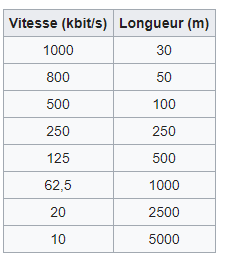
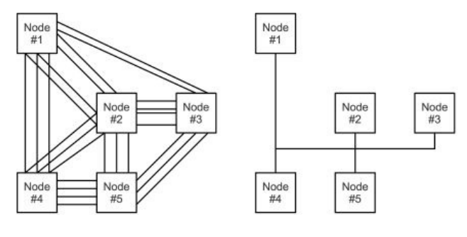
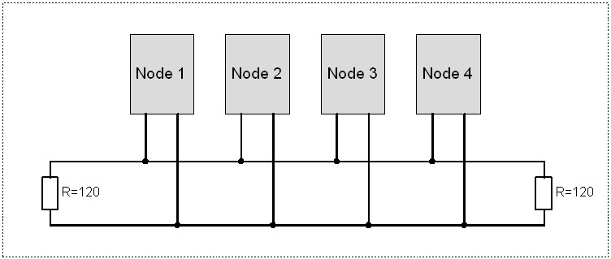
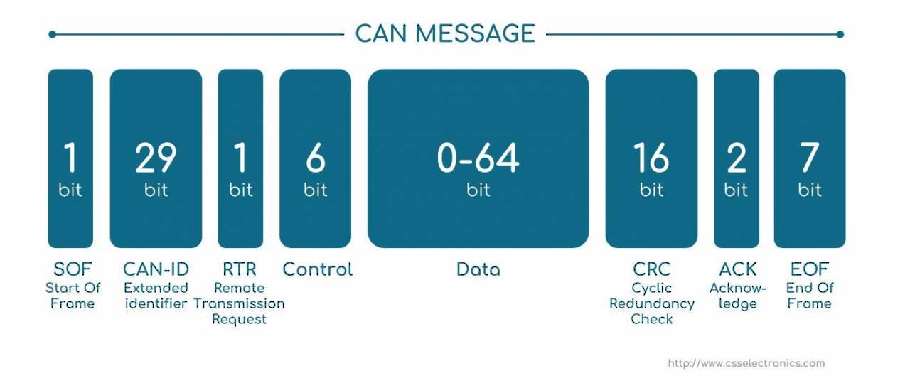

# Why using CANBus on the robots and how to implement it 

## Issues and context of the Eurobot ( 2018 )


Many technologies have been implemented on the robots for the 2018 edition of the EUROBOT.

Those technologies where where huge step forward in terms of quality, speed and ease of use.

However, unexpected downsides appeared during the implementation of the technologies on the robots.

Thoses downsides are of all type but those who are speaking about during this tutorial are **electronic* and **space**.


### Electronic problem

Once the board are installend on the robots, they needed a lot of connections between them. The last picture remembers the kind of resul we got after connecting all the wires.

From that moment it is very complex to add or remove wires because.

It is also very complex for the debugging because it is hard to make measure and to find where the error is.


### Space problem

Another problem wich appeared and thaht couldn't have been expected is the huge space token by the wires.

During the conception the **mistake** we did is to disregard the size of the wires. It should be in the futur by taking some leeway on the size of the robot during the conception.


The huge number of wires had also an mechanical impact. It added constraint on the connexions wich often broke.

## Le CANBus

### Context
Those problem have already been meet many years ago in the automotive. Indeed, more and more electronic devises where used in the cars for differents purposes :

* Engine temperature, air...
* RPM, speed...
* accelerometer...
* Safety, ABS, Airbag, opened doors, seatbelt...

### Specifications

We can cleary see that with the number of wires increasing the wiring harness became a real problem.

To resolve this, BOSCH developped the CANBus with several caracteristics :

* High speed communication up to 1 Megabit/s (see the table below for more information)
* Real time ( wich makes CANBus better than TCP/IP)
* Error detection, fast recovery and repair ( stil in real time)
* Security and stability
* Priorization of transmission
* Based on a differiental signal, the CANBus is made for harsh environnements (External noises and fault tolerance
* It uses a twisted pair cable wich limit the noise emition

You can see below the speed transmission according to the distances




#### Topology

Finally, the biggest benefit of the CANBus is his one bus line topology which limit the number of cable to 4. (CAN HIGH, CAN LOW, VCC and GROUND).


This the reason why it is used on every modern car.
 



We can see on the last figure a system without the CANBus (left) and a system with the CANBus (right).

Every component, called a node, is connected to the bus line like the figure below :



By analogy, the CANBus can be represented by a numbers of people ( the nodes ) in a room ( the bus line ) where everybody screams his informations. Everyelse has the choice to listen or not. A priority system choose who is going to speak when several people want to sepak at the same time.

### The frame



A data frame is made of different parts : 

* 1 dominant bit begins the frame
* The ID of the message is made of 11 bits in the standart CAN or 29 bits in the extended CAN.
* 6 bits wich determine the lenght of the frame
* The data made of 0...8 bytes
* 15 bits of CRC to detect errors
* ACK
* End of frame bit

### Priority of transmission

Lorsque plusieurs noeud veulent communiquer en même temps sur le Bus, c'est le champ d'arbitrage qui va déterminer la priorité. Elle sera donné au premier noeud présentant un bit dominant (0) alors que les autres noeuds présentent un bit récessif. 

When differents nodes whant to talk at the same time on the bus line, it is the ID wich is going to determine the priority. 

It gives an important advantage to CANBus, it is possible to make priority of transmission by choosing the right ID. For example, in car the brake is system is more important than the light system. The ID of the brake system will be lower ( more 0 ) than the light system.


## Implementation

### Hardware


The last figure shows the implementation of the CANBus. The implementation is quite easy because of the modules proposed by Microchip.


A node is made of a transceiver, a CAN controller and a microcontroller. 

#### Transceiver

Microchip propose un grand nombre de solutions pour l'automobile. Parmi celles-ci un transceiver. 

Microchip proposes a huge numbers of solutions for the automotive including a transceiver.

It is the MCP2562. Formerly the MCP2551, it is used to convert the TTL signal to a differential signal required by the CANBus.


#### Controller 

Microchip also proposes the CAN controller MCP2515 wich implements all the CAN 2.0 specifications. It is able to send and receive data and communicate it via SPI to a microcontroller.

#### Microcontroller.
Any microcontroller with a integrated SPI communication can be selected.

For example we can take the famous ATMEGA328p know for his arduino IDE.

#### Resistance

In every communication wire there is some reflexion that can corrupt the data. It can be avoided by using 120 Ohm resistor at the end of line.

#### PCB

Coming soon.

### Software (Arduino)

There are many libraries that proposes functions to interract with the CAN controller via SPI from the micrcontroller.

A very comlete and up to date library is the Seed studio lib :
<https://github.com/Seeed-Studio/CAN_BUS_Shield>


#### Filters

Filters allow to choose wich messages will be sent to the microcontroller from the CAN controller.

The MCP2515 is able the define 6 filters. For example :

```javascript
CAN.init_Filt(0, 0, 0x04);                          
CAN.init_Filt(1, 0, 0x05);                          
```

This code means that the CAN controller will only lister the the messages with an ID of 0x04 and 0x05.

#### Masks
The masks defines the bits that will be inspected to filter the coming ID. If the bit of the mask is 1, it means that the ID has to respect the bit of the filter.

For example with the following filter : 

```javascript
0100 1101
```

If the mask is :
```javascript
1111 1111
```
Then it means that the accepted ID has to have exactly the same bits thant the filter because all the masks bits are 1. Only a message witch the next ID will be accepted : 

```javascript
0100 1101
```
Now, if the mask is this one :

```javascript
1111 1110
```
It means that the filter will not inspect the last bit of the ID.

The next ID's will be accpeted

```javascript
0100 1100
0100 1101
```

# Usefull links

- Introduction to CANBus by Texas Instrument, <http://www.ti.com/lit/an/sloa101b/sloa101b.pdf> 
- CAN specs by BOSCH, <https://www.kvaser.com/software/7330130980914/V1/can2spec.pdf>
- CANBus implementation with Arduino, <http://www.prometec.net/wp-content/uploads/2015/07/Controller-Area-Network-Prototyping-With-Arduino-Wilfried-Voss.pdf>
- Well documented on Wikipedia, https://en.wikipedia.org/wiki/CAN_bus

