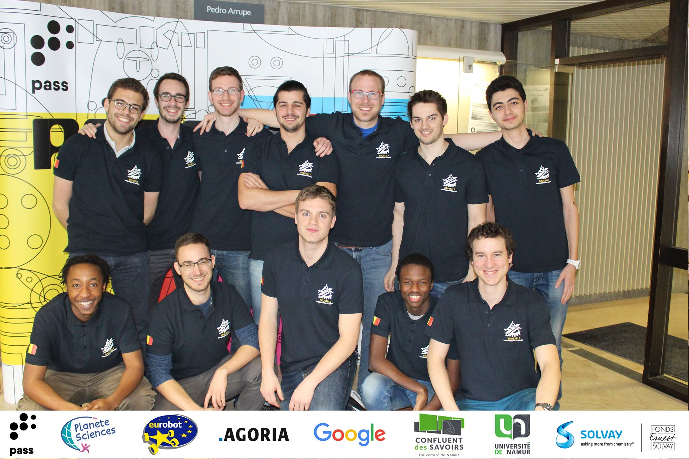

# Introduction

This book contains learning ressources and tutorials about many of the technologies 
we used for our participation(s) in the Eurobot contests.

The [Eurobot contest](http://www.eurobot.org/) is an international amateur robotics contest.
The objective is to build an autonomous robot that needs to accomplish a given set of tasks, earning you points.

Through this book, we hope to be able to transfer the knowledge and experience we have acquired during our participation to 
the team that will participate next year. Our hope is that over the years, this ressource will grow with each participation
to become a huge source of information for anyone that wants to participate in the contest.

# 2018

