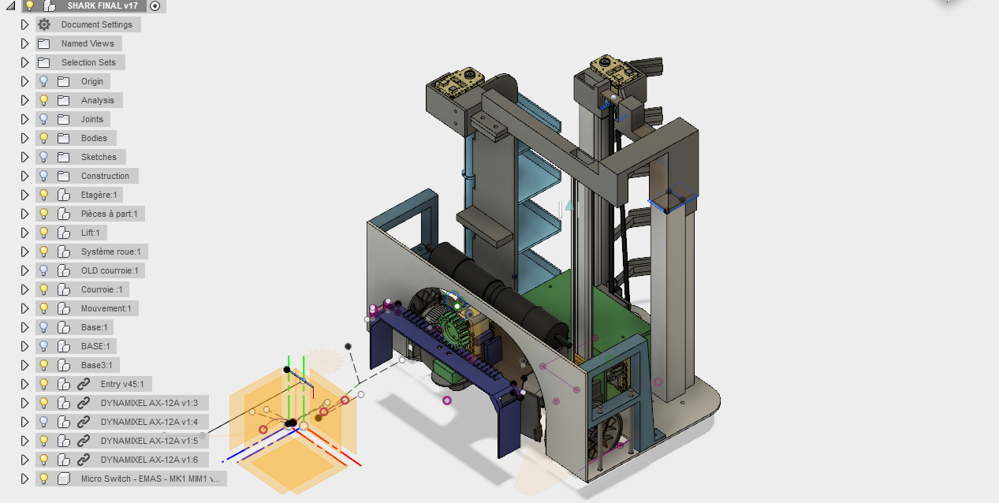

# The big robot specifications

## Fusion 360

The entire robot is designed in Fusion 360 and is available on the Eurobot cloud. The final version is called **SHARK FINAL V17**

## Parts

Most of the part are home made (CNC, 3D printing) but some parts a bought on the market :

* **IGUS rail**
  * *Small one*
    * Rail : Igus N Series, NS-01-17-300, Linear Guide Rail 17mm width 300mm length
    * Carriage : Igus Linear Guide Carriage NW-02-17, N
  * *Big one* : 
    * Rail : Igus N Series, NS-01-27-300, Linear Guide Rail 27mm width 300mm length
    * Carriage : Igus Linear Guide Carriage NW-02-27, N
* **Lift transmission**
  * *Pitch (distance between tooths)* : 2.032 mm
  * *Pulley* : aluminium, Glass Filled PC Timing Belt Pulley, 6mm Belt Width x 2.032mm Pitch, 36 Tooth, Maximum Bore Dia. 5mm
  * *Timing belt* : RS Pro, Timing Belt, 315 Tooth, 640.08mm Length X 6mm Width

* **Limit switch**
  * Snap Action Limit Switch, Roller Lever, Thermoplastic, NC, 125V
