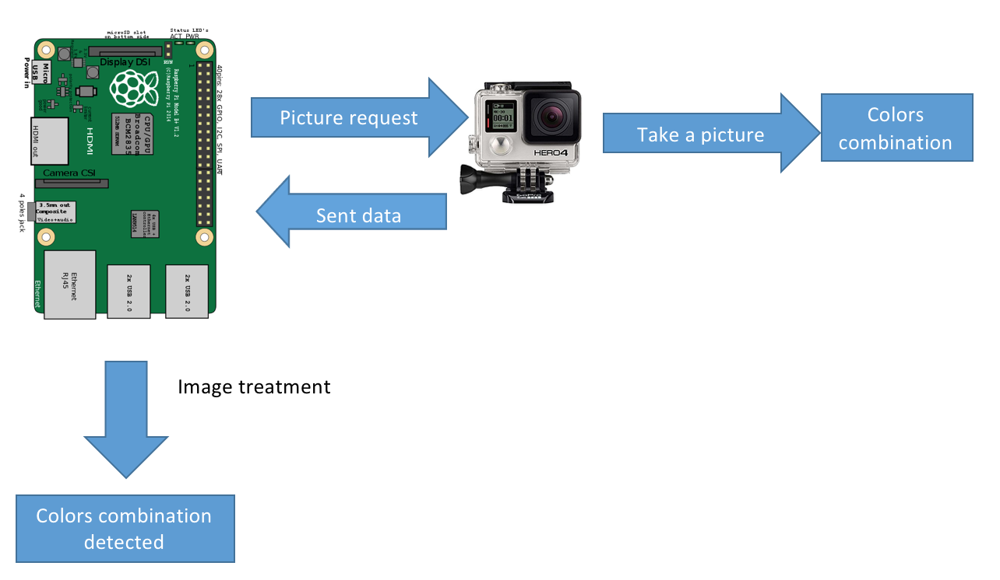
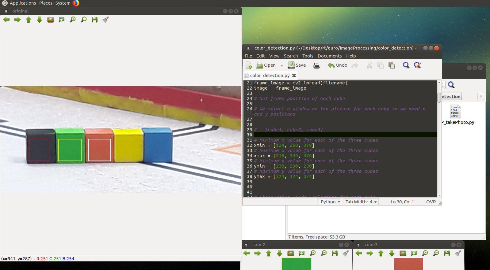

# Color detection

>The objective of this module is to detect a color combination and send it to the “Minus” robot module whose function is to build a tower made of cubes.

## Getting started

### Image treatment module


#### Aim 

First and foremost, we must connect to GoPro wifi to take a picture of the color combination. Here, we have chosen a GoPro as a camera because it has an acceptable quality (780 pixel-HD) and it has also a Wi-Fi module for the remote control.

Once the photo has been taken, the camera automatically switches off and we connect to the robot by wifi (a Raspberry connected with the same Wi-Fi for future image treatment).

During this treatment, we use the OpenCV free graphics library.

We have drawn three frames on the picture (one for each cube to detect) to delimit the test portion. 
  
The board analyzes all pixels within each frame: 
1.	It looks whether the color detected is in the range color defined for every color (each color range is defined with one high and one low BGR value)
2.	After that, it returns a value: more the value is great, more the color lies within the range. The program adds up the values and the final value thus obtained determines the color within the range of colors determined initially. 

However, we have implemented in our program the different possible combinations to save time. Indeed, we only required two colors to deduce the final combination.

As a matter of conclusion, we send combination to the robot by ROS. 


#### Bill of materials: 

- One Raspberry Pi zero W
- One Wi-Fi GoPro (Hero+) 
- One 5V battery
- Etcher (https://etcher.io/) to install an OS on the Raspberry

#### Connections

- No pins required  

#### Setup 
- Download last version Ubuntu mate (16.04) or an another distribution for the raspberry (see [install](ros/install.md))
- Active WiFi and open terminal (***alt+ctrl+t***):
	1) Install ROS (see [install](ros/install.md))
	2) Import this repo from github 
	3) Go to "codes" folder: 
		```
		cd src/codes/software/image-processing/tests
		```
	4) Connect the GoPro or your webcam to the Raspberry
	4) For testing the camera, go to "test camera" folder : 
		```
		cd test_camera
		```
		- For GoPro: 
		```
		python3 go_pro_test.py
		``` 
		***Don't forget to connect the GoPro WiFi to the raspberry Pi !***
		
		- For the webcam: 
		```
		python webcam_test.py
		``` 
	
**Scripts**
- Go to color_detection folder :
```
cd ../test_color_detection
```
- Open GP_combination.sh :
```
nano GP_combination.sh 
```  
- Change ***line3*** with the name of your GoPro WiFi :
```
nmcli c up "your GoPro wifi"
```
- Change ***line6*** with the name of robot WiFi 
```
nmcli c up "your wifi robot"
```
save it (***ctrl+x***)

- Run this script on the terminal : 
```
bash GP_combination.sh 
``` 
If you use the webcam : 
```
bash WB_combination.sh 
```
You'll see 3 colors frames on the picture and the final combination color on the terminal)

##### Adjust position of a frame
- Maintain your cursor where you want to place a side of the frame.
- Take note of the position. 
- Open a new tab (***ctrl+shift+t***)
- Change the position in the code :
```
nano color_detection.py
```

Note : xmin is the left side of the square, xmax is the right side of the square, ymin is the top side of the square and ymax is the bottom side of the square.
- Restart for another side of the frame and save the file (***ctrl+x***)



##### Adjust range color 
- Maintain your cursor in the center of the cube 
- Take note of the RGB color  
- Open a new tab (***ctrl+shift+t***)
- Change the color range in the code (color_detection.py) and save the file (***ctrl+x***)


##### ROS

You use ***ROS*** to send the color combination to another robot module :
- Open terminal and launch ROS : 
````
. ~/eurobot_ws/devel/setup.bash
roslaunch image-processing test.launch 
```` 
- Open a new tab (***ctrl+shift+t***) and display messages published to a topic : 
 
```` 
rostopic echo /color_seq 
````
***Don't forget to change frames positions and color ranges !***
### Flashlight module

#### Aim

We added a LED flashlight above the camera because light is an important factor and can bias our previous calculations. Therefore, the constant level of light thus created enables us to maintain our settings. This flashlight is turned off immediately after the camera has taken the photo, so as not to disrupt other teams or distract the audience. 

#### Bill of materials: 

- One Raspberry Pi zero W
- One LED flashlight 
- One 5V battery

#### Connections

We use pin 4 of the raspberry Pi zero to power the gate pin of IRF520 mosfet in order to control the light. The board is powered with a 5V power supply from the battery (pin 2 = 5V and pin 6= GND).

#### Setup 
- for testing the flashlight, run :  
```
python flashlight.py
```
